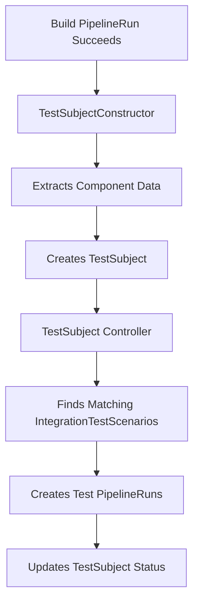

# Konflux Integration Service

The Konflux Integration Service is a Kubernetes operator that orchestrates automated integration testing for software components in Red Hat Konflux. It implements the ADR-0033 architecture, providing a modern, upstream-compatible integration testing framework.

## Architecture Overview

The Integration Service operates on three core custom resources:

### 🔧 TestSubjectConstructor
Automatically creates **TestSubjects** from external events (like successful builds). Uses JQ-like expressions to extract data from trigger resources.

### 🎯 TestSubject  
Represents a collection of components that should be tested together. Contains component images, source information, and test results.

### 📋 IntegrationTestScenario
Defines which tests to run for TestSubjects using label selectors. Specifies Tekton pipelines and parameters for test execution.

## How It Works



## TestSubjectConstructor Deep Dive

TestSubjectConstructors are the backbone of the automated integration testing workflow. They continuously monitor for specific Kubernetes resources and automatically transform them into TestSubjects for integration testing.

### Key Features

- **Event-Driven**: Responds to resource creation/updates in real-time
- **Flexible Selection**: Uses field and label selectors to target specific resources
- **Data Extraction**: Employs JQ-like expressions for powerful data transformation
- **Template System**: Configurable TestSubject templates with labels and annotations
- **Multi-Component Support**: Can merge data from multiple builds into cumulative TestSubjects

### Example Configuration

```yaml
apiVersion: integration.konflux-ci.dev/v1alpha1
kind: TestSubjectConstructor
metadata:
  name: build-to-test-constructor
spec:
  # Select successful build PipelineRuns
  selector:
    labels:
      match:
        "pipelines.appstudio.openshift.io/type": "build"
  
  # Extract component data using JQ expressions
  extractor:
    name: '.metadata.labels["appstudio.openshift.io/component"]'
    image_url: '.status.results[] | select(.name == "IMAGE_URL") | .value'
    source:
      git:
        url: '.status.results[] | select(.name == "CHAINS-GIT_URL") | .value'
        revision: '.status.results[] | select(.name == "CHAINS-GIT_COMMIT") | .value'
  
  # Template for created TestSubjects
  template:
    labels:
      integration.konflux-ci.dev/test-subject-group: "my-application"
      created-by: "build-constructor"
```

### Data Extraction with JQ

TestSubjectConstructors use JQ-like expressions to extract data from any field in the triggering resource:

| Field | Purpose | Example Expression |
|-------|---------|-------------------|
| `name` | Component identifier | `.metadata.labels["component"]` |
| `image_url` | Container image URL | `.status.results[] \| select(.name == "IMAGE_URL") \| .value` |
| `source.git.url` | Git repository URL | `.spec.params[] \| select(.name == "git-url") \| .value` |
| `source.git.revision` | Git commit/branch | `.status.results[] \| select(.name == "CHAINS-GIT_COMMIT") \| .value` |

### TestSubject Groups and Control Management

TestSubjects are organized into **groups** using the `integration.konflux-ci.dev/test-subject-group` label:

- **Logical Grouping**: Components of the same application share a group
- **Control TestSubject**: One TestSubject per group serves as the stable baseline
- **Automatic Promotion**: Successful TestSubjects automatically become the new control
- **Cumulative Updates**: New builds merge into existing group TestSubjects

## Integration Test Execution

### IntegrationTestScenario Selection

IntegrationTestScenarios use **label selectors** to target TestSubjects:

```yaml
apiVersion: integration.konflux-ci.dev/v1alpha1
kind: IntegrationTestScenario
metadata:
  name: security-scan
  labels:
    test.appstudio.openshift.io/optional: "false"  # Required test
spec:
  selector:
    matchLabels:
      integration.konflux-ci.dev/test-subject-group: "my-application"
  resolverRef:
    resolver: git
    params:
    - name: url
      value: https://github.com/myorg/test-definitions
    - name: pathInRepo
      value: security/scan-pipeline.yaml
  params:
  - name: IMAGE_URL
    value: "$(test_subject.components.component-name.containerImage)"
```

### Parameter Substitution

The Integration Service automatically substitutes TestSubject data into PipelineRun parameters:

- `$(test_subject.components.component-name.containerImage)` → Actual component image URL
- `$(params.TEST_SUBJECT_NAME)` → TestSubject name
- Standard Tekton parameter substitution also available

### Test Status Management

TestSubject status automatically tracks test execution:

```yaml
status:
  testResults:
  - scenario: security-scan
    status: Passed
    startTime: "2023-10-01T10:00:00Z"
    completionTime: "2023-10-01T10:05:00Z"
    logURL: "/logs/pipelinerun/default/my-test-subject-security-scan"
  - scenario: performance-test
    status: InProgress
    startTime: "2023-10-01T10:06:00Z"
```

## Development

### Running the operator locally

When testing locally (eg. a CRC cluster), the command `make run install` can be used to deploy and run the operator.
If any change has been done in the code, `make manifests generate` should be executed before to generate the new resources
and build the operator.

### Build and push a new image

To build the operator and push a new image to the registry, the following commands can be used:

```shell
$ make img-build
$ make img-push
```

These commands will use the default image and tag. To modify them, new values for `TAG` and `IMG` environment variables
can be passed. For example, to override the tag:

```shell
$ TAG=my-tag make img-build
$ TAG=my-tag make img-push
```

Or, in the case the image should be pushed to a different repository:

```shell
$ IMG=quay.io/user/integration-service:my-tag make img-build
$ IMG=quay.io/user/integration-service:my-tag make img-push
```

### Adding/updating a dependency

This repo uses vendoring, please add dependencies in the following way:

```shell
go get example.com/dep@v1.2.3
go mod tidy
go mod vendor
git add vendor/
```

If you don't vendor dependencies, `go vet` will fail build.

### Running tests

To test the code, simply run `make test`. This command will fetch all the required dependencies and test the code. The
test coverage will be reported at the end, once all the tests have been executed.

### Integration Testing

The integration service includes comprehensive integration tests that run against real Kind clusters:

```shell
# Run integration tests
cd test/integration
make test-e2e

# Run specific test scenarios
ginkgo --focus="TestSubjectConstructor Workflow"
```

## Documentation

- [ADR-0033 Refactoring Guide](docs/adr-0033-refactoring-guide.md) - Detailed architecture documentation
- [Controller Documentation](docs/) - Individual controller guides
- [Testing Guide](docs/testing.md) - Testing approaches and best practices

## Migration from Legacy Architecture

This service implements ADR-0033, replacing the legacy snapshot-based architecture. Key changes:

- **TestSubjects** replace Snapshots for integration testing
- **Label-based selection** replaces application-based targeting  
- **Event-driven automation** via TestSubjectConstructors
- **Upstream compatibility** with no proprietary API dependencies

See the [ADR-0033 Refactoring Guide](docs/adr-0033-refactoring-guide.md) for detailed migration information.
